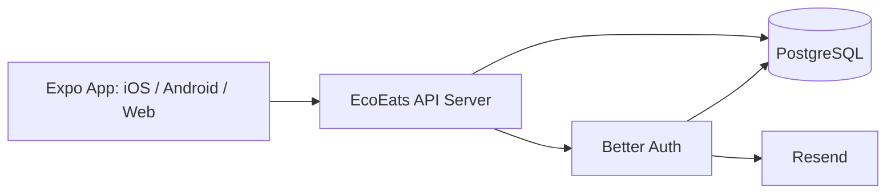

# Deployment Guide

This project now deploys as two things:

1. the Expo app
2. the EcoEats API server

There is no separate auth worker anymore. Better Auth runs inside the API server.

## Production Architecture



## What You Need

- a PostgreSQL database
- a deployed API server reachable over HTTPS
- a Resend account for magic-link emails
- Expo/EAS for app builds if shipping mobile apps

## Environment Variables

### API server

```env
PORT=3001
API_URL=https://api.ecoeats.app
DATABASE_URL=postgresql://...
AUTH_SECRET=replace-with-32-plus-random-chars
RESEND_API_KEY=re_...
AUTH_FROM_EMAIL=EcoEats <noreply@ecoeats.app>
CORS_ORIGINS=https://app.ecoeats.app,ecoeats://
```

### Expo app

```env
EXPO_PUBLIC_SERVER_URL=https://api.ecoeats.app
```

## Database Setup

### 1. Better Auth tables

Run:

```bash
bun run auth:migrate
```

This creates Better Auth tables in your Postgres database.

### 2. App tables

Run the SQL in [001_init_app_tables.sql](/Users/divkix/GitHub/EcoEats/server/sql/001_init_app_tables.sql).

That creates:

- `users`
- `listings`
- `claims`

## Deploying The API

The API is just a Bun/Node-style server using Hono and `pg`.

Any platform that can run a long-lived Node/Bun HTTP server is fine.

Typical options:

- Fly.io
- Render
- Railway
- a VM/VPS
- Docker on your own infrastructure

### API checklist

1. set production env vars
2. run `bun install`
3. run `bun run auth:migrate`
4. apply app schema SQL
5. start the server with `bun run api`
6. point `EXPO_PUBLIC_SERVER_URL` at the deployed API

## Deploying The Expo App

### Web

```bash
npx expo export --platform web
```

Then deploy the output to any static host.

### Mobile

```bash
eas build --platform ios
eas build --platform android
```

## Production Checks

After deployment, verify:

1. `GET /health` returns `200`
2. magic-link email sends successfully
3. clicking the link signs in on web
4. deep-link callback works on device
5. authenticated calls to `/api/users/me` succeed
6. listings load from `/api/listings`

## Domain Setup

Recommended split:

- app: `app.ecoeats.app`
- api: `api.ecoeats.app`

Then set:

- `API_URL=https://api.ecoeats.app`
- `EXPO_PUBLIC_SERVER_URL=https://api.ecoeats.app`
- `CORS_ORIGINS=https://app.ecoeats.app,ecoeats://`

## Notes

- Supabase can still be the Postgres host, but only as a database host.
- The client should not need Supabase URL or anon key anymore.
- If you move to another Postgres provider later, update `DATABASE_URL` and rerun migrations if needed.
