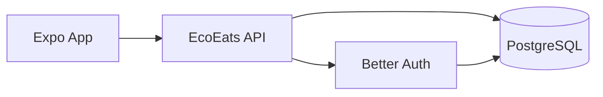

# EcoEats

Campus food rescue app built with Expo, Better Auth, Hono, and PostgreSQL.

## Architecture



- The Expo app only talks to your API.
- The API owns auth and data access.
- PostgreSQL is the persistence layer.
- Supabase can still host Postgres for now, but the app is no longer coupled to Supabase client features.

See [how-it-works.md](/Users/divkix/GitHub/EcoEats/docs/how-it-works.md) for the full walkthrough.

## Quick Start

1. Install dependencies:

```bash
bun install
```

2. Copy envs:

```bash
cp .env.example .env.local
```

3. Fill in:

- `DATABASE_URL`
- `AUTH_SECRET`
- `RESEND_API_KEY`

4. Create Better Auth tables:

```bash
bun run auth:migrate
```

5. Create app tables with [001_init_app_tables.sql](/Users/divkix/GitHub/EcoEats/server/sql/001_init_app_tables.sql)

6. Start the API:

```bash
bun run api:dev
```

7. Start Expo:

```bash
bun start
```

## Commands

```bash
bun run api         # Start API server
bun run api:dev     # Start API server with watch mode
bun run auth:migrate

bun start
bun run ios
bun run android
bun run web

bunx tsc --noEmit
bunx biome check .
bunx knip
```

## Environment

Use [.env.example](/Users/divkix/GitHub/EcoEats/.env.example).

Important variables:

- `EXPO_PUBLIC_SERVER_URL`: public URL the Expo app uses for API calls
- `API_URL`: canonical server base URL used by Better Auth on the server
- `DATABASE_URL`: Postgres connection string
- `AUTH_SECRET`: Better Auth secret
- `RESEND_API_KEY`: email delivery key
- `CORS_ORIGINS`: comma-separated allowed origins

## Project Structure

```text
app/
  (auth)/              auth screens
  (tabs)/              main app tabs
src/
  contexts/            auth and toast state
  services/            typed client-side HTTP and auth wrappers
  stores/              Zustand state
  components/          UI and feature components
  types/               shared TypeScript types
shared/
  contracts/           shared Zod API contracts
server/
  index.ts             Hono entrypoint
  auth.ts              Better Auth setup
  db.ts                pg pool
  session.ts           auth guard
  routes/              users/listings/claims endpoints
  sql/                 app schema
docs/
  how-it-works.md
  portable-backend-migration.md
```

## Current Behavior

- Magic-link sign-in through Better Auth
- Bearer-token authenticated API requests from app to server
- Shared Zod contracts and Hono RPC typing between Expo and the API
- Listings polled every 20s
- Claims polled every 15s
- No direct Supabase SDK usage in the client

## Why This Shape

- Portability: changing Postgres hosts later should mostly be an env change
- Simplicity: one server instead of separate auth worker plus data client
- Ownership: business logic lives in your code, not vendor-specific client APIs
- MVP fit: polling is simpler than realtime and good enough for low traffic

## Status

Implemented now:

- portable API layer
- Better Auth server
- Postgres-backed app routes
- migration docs and diagrams

Still pending:

- map screen
- post listing flow
- claims UI
- impact dashboard
- release setup
