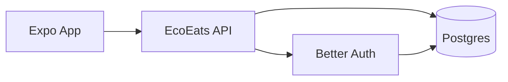
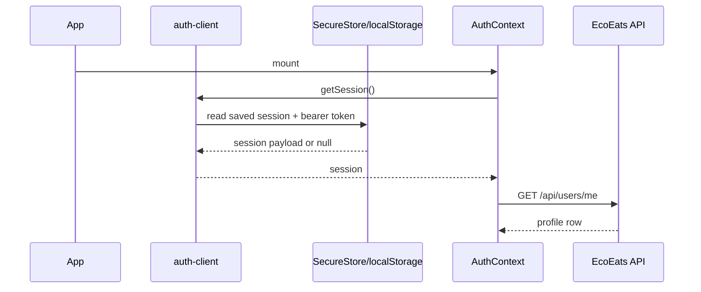
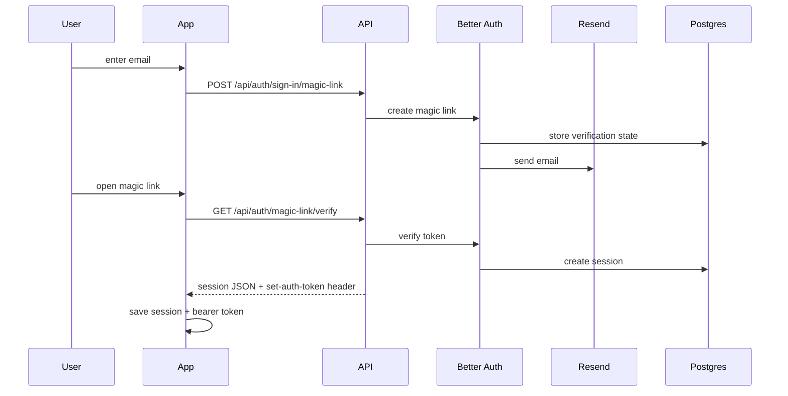
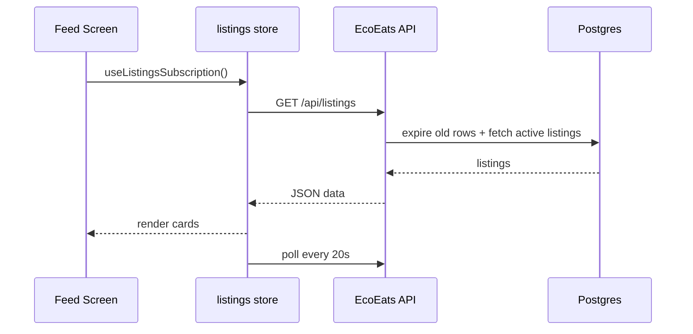
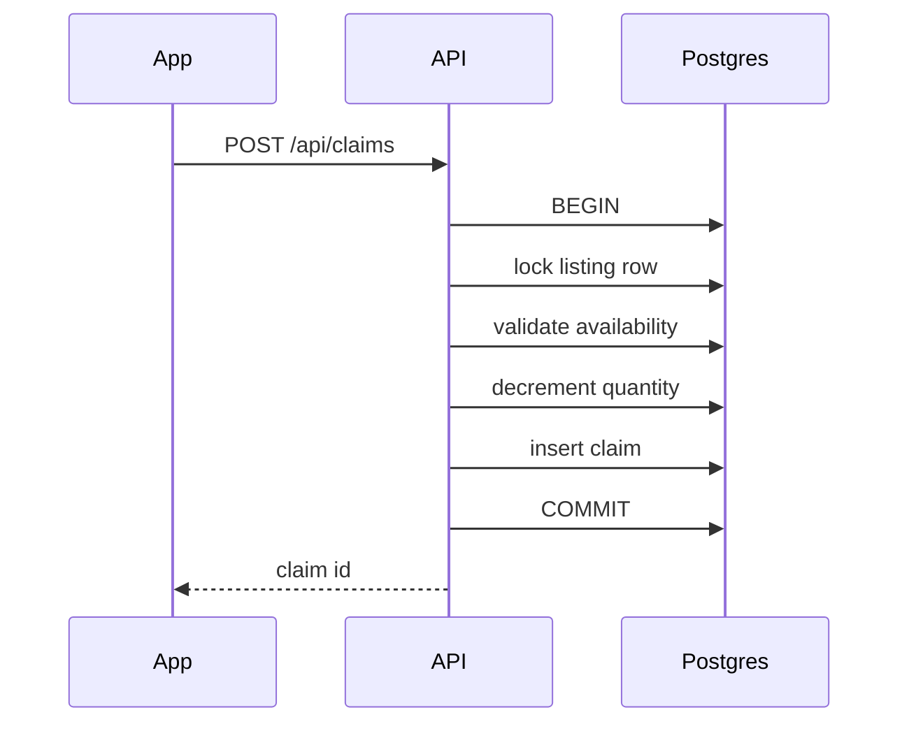

# How EcoEats Works Now

Date: 2026-04-09

This is the simplest mental model for the app:



## The Big Idea

The mobile and web app no longer talk to Supabase directly.

Instead:

- the app talks to one server you own
- that server handles auth and data access
- the database is just PostgreSQL underneath

That is why the app is now more portable. If you move from Supabase Postgres to another Postgres host later, the app code should barely change.

## Why It Works This Way

### 1. The client has one backend to talk to

Before, the app had two backend relationships:

- Better Auth for sign-in
- Supabase client SDK for listings, users, and claims

That split made the app harder to reason about because auth state and data access were handled by different systems with different assumptions.

Now the app has one backend relationship:

- `src/services/*` calls your own API

This is simpler because all authenticated requests go through the same place.

### 5. API contracts are shared between client and server

The app now has one contract layer in:

- `shared/contracts/*`

Those schemas are used in two places:

- Hono routes validate requests and shape responses from them
- Expo services infer request and response types from the Hono app

That is what removes most frontend/backend drift. Instead of manually keeping
two copies of each API shape in sync, the repo now has one shared contract
layer and one typed client.

### 2. Auth is server-owned, not vendor-owned

Magic-link login is handled by Better Auth in [auth.ts](/Users/divkix/GitHub/EcoEats/server/auth.ts#L1).

Why this is better:

- you still avoid passwords
- you control the auth server
- Better Auth stores its tables in normal Postgres
- the client stores only the session data and bearer token it needs

### 3. Database access is centralized

All database reads and writes now happen in:

- [users.ts](/Users/divkix/GitHub/EcoEats/server/routes/users.ts#L1)
- [listings.ts](/Users/divkix/GitHub/EcoEats/server/routes/listings.ts#L1)
- [claims.ts](/Users/divkix/GitHub/EcoEats/server/routes/claims.ts#L1)

That means business rules live on the server, not spread across the client.

Example:

- creating a claim updates listing quantity and inserts the claim in one transaction on the server

That is safer than trusting the client to coordinate multiple database writes itself.

### 4. Polling replaced Supabase Realtime

The feed and claims views now poll your API every few seconds instead of subscribing to Supabase Realtime.

Why:

- it removes another Supabase-specific dependency
- it is easier to debug
- it is enough for an MVP with low traffic

Tradeoff:

- updates are not instant
- but the code is much simpler

## File-Level Map

### Client side

```text
app/
  (auth)/login.tsx
  (auth)/auth/callback.tsx
  _layout.tsx

src/contexts/
  AuthContext.tsx

src/services/
  auth-client.ts
  rpc-client.ts
  users.ts
  listings.ts
  claims.ts

shared/contracts/
  common.ts
  database.ts
  users.ts
  listings.ts
  claims.ts
```

### Server side

```text
server/
  index.ts
  auth.ts
  db.ts
  config.ts
  session.ts
  routes/
    users.ts
    listings.ts
    claims.ts
  sql/
    001_init_app_tables.sql
```

## End-to-End Flows

### App startup



What this means:

- the UI boots from locally stored auth state first
- then it hydrates the user profile from your API

### Sign-in flow



Why the bearer token matters:

- the app needs a portable way to authenticate API requests on mobile and web
- Better Auth issues the token
- `auth-client.ts` stores it and `rpc-client.ts` sends it in the `Authorization` header
- `rpc-client.ts` also throws API errors centrally so feature services only handle success paths

### Feed flow



### Claim flow



Why this works well:

- race-sensitive logic stays on the server
- the client sends intent, not raw DB operations

## What Each Important File Does

### [server/index.ts](/Users/divkix/GitHub/EcoEats/server/index.ts#L1)

- starts the Hono server
- applies CORS
- mounts auth routes
- mounts app routes

### [server/auth.ts](/Users/divkix/GitHub/EcoEats/server/auth.ts#L1)

- configures Better Auth
- enables magic-link login
- enables bearer-token auth for API requests
- sends emails through Resend

### [server/session.ts](/Users/divkix/GitHub/EcoEats/server/session.ts#L1)

- checks the bearer token or auth headers
- rejects unauthenticated requests
- makes the current session available to route handlers

### [src/services/auth-client.ts](/Users/divkix/GitHub/EcoEats/src/services/auth-client.ts#L1)

- requests magic links
- verifies callback tokens
- stores session and bearer token locally
- exposes `getAccessToken()` for the typed API client

### [src/services/rpc-client.ts](/Users/divkix/GitHub/EcoEats/src/services/rpc-client.ts#L1)

- creates a typed Hono client from the backend route tree
- adds `Authorization: Bearer ...` automatically
- normalizes API errors
- keeps the rest of the app from knowing transport details

### [shared/contracts](/Users/divkix/GitHub/EcoEats/shared/contracts/index.ts#L1)

- defines the request and response schemas shared across the repo
- validates route inputs on the server
- keeps Expo request and response types aligned with Hono

### [src/contexts/AuthContext.tsx](/Users/divkix/GitHub/EcoEats/src/contexts/AuthContext.tsx#L1)

- owns the app’s current session
- loads the profile after sign-in
- creates a profile on first login if needed

## Database Ownership

You now own two sets of tables in the same Postgres database:

- Better Auth tables for sessions and verification
- EcoEats app tables for users, listings, and claims

That is normal. Better Auth handles identity. Your app routes handle app data.

## Why This Is More Portable

If you move databases later:

- the app still calls the same API routes
- the auth flow stays the same
- only the server’s `DATABASE_URL` changes

If you stayed on direct `supabase-js`, the client would still know about:

- Supabase URL
- Supabase auth model
- Supabase realtime model
- Supabase REST conventions

That is the lock-in this migration removes.

## What Is Still Intentionally Simple

- polling instead of websockets
- SQL in route handlers instead of introducing an ORM
- one API server instead of splitting auth and app APIs

That is deliberate. For an MVP, fewer moving parts is usually the right tradeoff.
