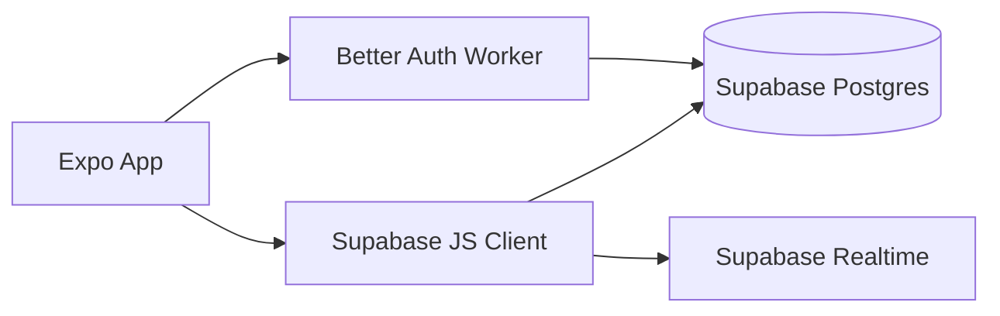
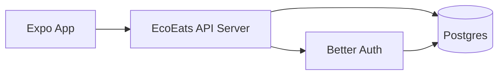
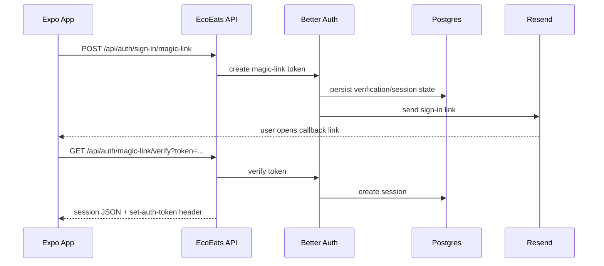
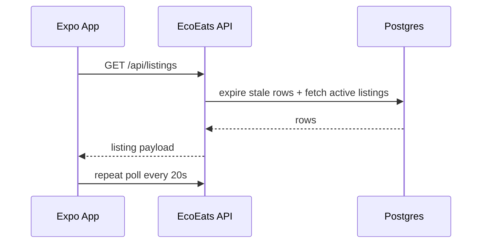

# EcoEats Portable Backend Migration

Date: 2026-04-09

## Why This Migration Exists

The app originally mixed:

- Better Auth for sign-in
- Supabase client SDK for data access and realtime
- A separate Cloudflare Worker for auth hosting

That made the architecture harder to move and harder to reason about. It also created a boundary problem: the app had Better Auth sessions, but the data layer still expected Supabase-native auth/RLS behavior.

## Current vs Target

### Before



Problem areas:

- The client knew about Supabase-specific APIs directly.
- The auth runtime lived in a separate Worker package.
- Realtime depended on Supabase client features.
- Better Auth session state and Supabase data auth were separate concerns.

### After



What changed:

- The app now calls your own API instead of `supabase-js`.
- Auth and app data live behind one first-party server.
- Supabase is only the Postgres host for now.
- Realtime subscriptions were replaced with polling for MVP simplicity.

## Visual File Map

```text
app/
  (auth)/
    login.tsx              -> requests magic link
    auth/callback.tsx      -> verifies token and hydrates profile
src/
  contexts/AuthContext.tsx -> session + profile lifecycle
  services/
    auth-client.ts         -> Better Auth client wrapper + bearer token storage
    rpc-client.ts          -> typed Hono client + authenticated transport
    users.ts               -> profile API calls
    listings.ts            -> listings API calls + polling
    claims.ts              -> claims API calls + polling
shared/contracts/         -> shared request/response schemas
server/
  index.ts                 -> Hono server entrypoint
  auth.ts                  -> Better Auth config
  db.ts                    -> pg connection pool
  routes/
    users.ts               -> /api/users/*
    listings.ts            -> /api/listings/*
    claims.ts              -> /api/claims/*
  sql/
    001_init_app_tables.sql -> portable app schema
```

## Main Runtime Flows

### Magic Link Sign-In



### Feed Load



## How To Run The New Stack

1. Set env vars in `.env.local`:

```env
EXPO_PUBLIC_SERVER_URL=http://localhost:3001
DATABASE_URL=postgresql://...
AUTH_SECRET=your-32-char-secret
RESEND_API_KEY=re_...
AUTH_FROM_EMAIL=EcoEats <noreply@ecoeats.app>
```

2. Create Better Auth tables:

```bash
bun run auth:migrate
```

3. Create app tables with [001_init_app_tables.sql](/Users/divkix/GitHub/EcoEats/server/sql/001_init_app_tables.sql)

4. Start the API:

```bash
bun run api:dev
```

5. Start Expo:

```bash
bun start
```

## Portability Outcome

Old coupling:

- Client depended on Supabase REST/realtime conventions
- Auth depended on Cloudflare Worker deployment

New coupling:

- Client depends only on your HTTP API
- Backend depends only on Better Auth, Hono, and PostgreSQL
- Database host can change as long as it speaks Postgres

## Cleanup Status

Completed:

- removed direct `supabase-js` usage from the client
- removed the separate auth worker package
- replaced old deployment docs with the new API-based deployment path

Still intentionally simple:

- polling instead of realtime
- route-level SQL instead of an ORM

If you need live updates later, add websockets or SSE behind your own API instead of re-coupling the app to vendor-specific realtime clients.
